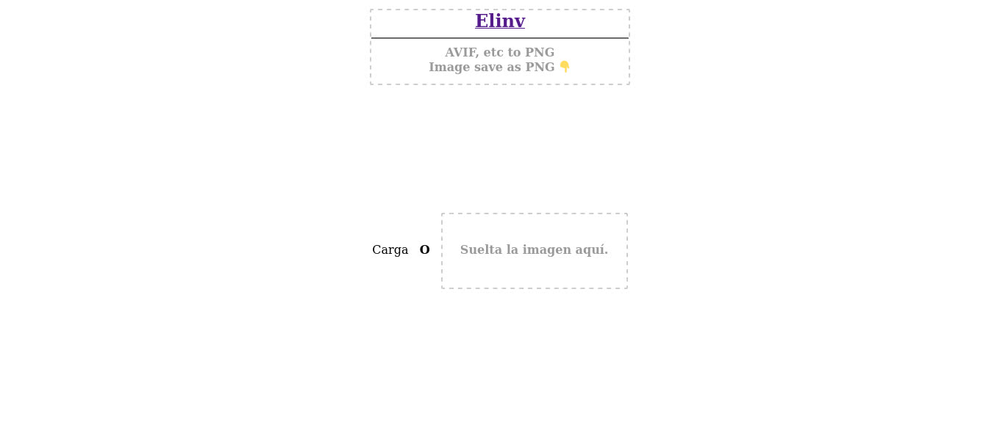

# avif-webp-all-image-to-png
Convertir cualquier formato de imagen web a PNG y poder bajarla a disco.

# Una vez convertida
## Sobre la imagen, 
presionan el boton derecho del mouse
y la salvan a disco como PNG.

   Enlace a la info de Elinv  -> en Google Search
</a>

- Ver canciones de Elinv:

<a href="https://www.reverbnation.com/elinv">
   Enlace a las canciones de Elinv  -> en Reverbnation
</a>

👍 Gracias!

🛠️ Errores, sugerencias, ideas, envialas a nuestro mail: <elinv.elinv@gmail.com>

## 	Demo

# E L I N V